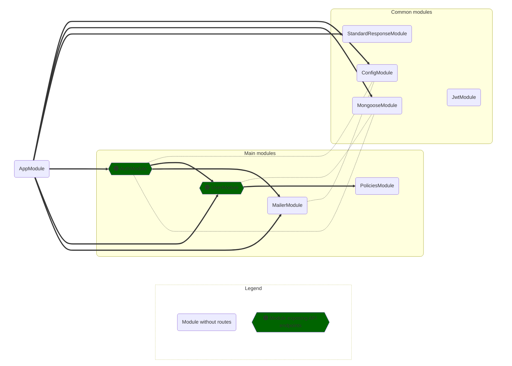

# A fully-decorated nest ready to fly

<a href="https://www.npmjs.com/package/nest-pret" target="_blank"></a>
<a href="https://github.com/simioni/nest-pret/blob/main/LICENSE" target="_blank"></a>
<a href="https://www.npmjs.com/package/nest-pret" target="_blank"></a>
<a href="https://www.npmjs.com/package/nest-pret" target="_blank"></a>
<a href="https://www.npmjs.com/package/nest-pret" target="_blank"></a>
<!-- <a href="https://app.circleci.com/pipelines/github/simioni/nest-pret" target="_blank"></a> -->


### Tested, documented, and production-ready.
</br>

**Nest Pret** is a replicable NestJS project that solves much of the functionality required from a modern web app.

- User registration
- Password recovery<!-- - User consent for TOS, Cookies, Policies, etc -->
- E-mail verification, configurable between:
  - ***required*** before login
  - ***delayed*** until a route with `@EmailVerifiedGuard()` enforces it
  - or ***off***
- Claims-based access control, including:
  - Restricted access to routes via policies
  - Restricted access to specific documents by ownership or other conditional constraints
  - Serialization of response objects exposing only the fields the user has access to
- Standardized API responses, including:
  - Automatic wrapping of return objects into a StandardResponse
  - Metadata-based — handlers remains returning Classes compatible with interceptors
  - Handling of pagination, sorting and filtering
  - Generation of OpenAPI documentation for routes with the proper combined response schema
  <!-- - Generation of OpenAPI response examples with proper serialization for each user role -->
- Secure defaults:
  - Sets secure HTTP response headers
  - Global validation of all request inputs
  - Global validation of response values before serialization
  - Rate-limiting across the app with tighter limits for account creation
- Configurable
  - Config module parses and validates .env variables during bootstrap
  - Config service makes them available app-wide with proper type definitions
- Deployable
  - Docker compose environmets for dev and e2e testing
  - Docker swarm stack ready for continous deployment
- Tested
  - Complete end-to-end testing suites
  - 100% coverage of all user interaction flows

<br />

# Getting started

* Clone this repo
* Edit the ```.env``` file and add at least your mailer service information.

<br />

## 🐳 &nbsp; Start using Docker
To start using Docker, run:

    npm run dev

This will start a docker compose with:
- the dev database<!-- - a redis instance; -->
- a mongo-express visual DB admin page at `localhost:8081`
- the NestJS app in watch mode at `localhost:3000`

Only for the `development` env, the app will also serve documentation and a dependency graph:

- Swagger UI documentation explorer: `localhost:3000/dev-tools/docs`
- Swagger documentation JSON: `localhost:3000/dev-tools/docs-json`
- MermaidJS graph providing a high level view of the inter-module dependencies: `localhost:3000/dev-tools/graph.mmd`

> If running in Docker, you're not required to run ```npm install``` locally, but you still might want to do so in order to get features such as auto-import and auto-complete in your code editor.

<br />
<br />

## 🐧 &nbsp; Start without docker

Make sure to edit ```.env``` file to add the connection information for your mongo database, then run:

    npm install
    npm run start:dev

<br />

## 🧐 &nbsp; Running tests

To run unit and integration tests (locally):

```
npm run test
```
or 
```
npm run test:watch
```

To run e2e tests:

```
npm run e2e
```

> This command will lift a full docker compose configuration with the testing environment, run all the tests against it, print the output, then immediately exit and prune all docker resources created.

You can also run e2e tests in watch mode:

```
npm run e2e:watch
```

Note that running in this mode will keep the entire docker testing environment up. Once you're done with testing, you can take it down and clear everything by running:

```
npm run e2e:down
```

<br />

---------------------------------------------------------------------------
<!-- # Motivation

NestJS achieves a great balance between performance, development speed and developer experience. By using TS/JS, it can tap on a vast ecosystem of libraries and tools

This project:
- enforces automatic linting and code formatting;
- is fully tested and encourages test-driven development;
- provides a "single source of truth" architecture for data Models that grant security in operations while avoiding code duplication;

<br />

## Model Classes as a "single source of truth" for data entities

In Typescript, data Models and their property types are usually defined as an `Interface` that is implemented by a schema or entity class 

- A schema, used by mongoose to provide type safety (and code completion, easier refactoring, etc...)
  - The schema contains all properties from the model, and represents the data exactly as it is saved in the DB
- Data validation on input
  - Contain only the fields that are acceptable for a given operation -->

# Tech stack

* Docker [compose](https://github.com/docker/compose) for development and testing, and [swarm](https://dockerswarm.rocks/) for deployment;
* Typescript
* MongoDB
* NestJS <sup>[source](https://github.com/nestjs/nest)</sup>
* Mongoose <sup>[source](https://github.com/Automattic/mongoose)</sup>
* PassportJS <sup>[source](https://github.com/jaredhanson/passport)</sup>
* Casl <sup>[source](https://github.com/stalniy/casl)</sup>
* Nodemailer <sup>[source](https://github.com/nodemailer/nodemailer)</sup>
* Nest Standard Response <sup>[source](https://github.com/simioni/nest-standard-response)</sup>
* Jest <sup>[source](https://github.com/jestjs/jest)</sup>
* PactumJS <sup>[source](https://github.com/pactumjs/pactum)</sup>
* NestJS Spelunker <sup>[source](https://github.com/jmcdo29/nestjs-spelunker)</sup>
* MermaidJS <sup>[source](https://github.com/mermaid-js/mermaid)</sup>
* Swagger / OpenAPI <sup>[source](https://github.com/swagger-api)</sup>

<br />

# App Graph


---------------------------------------------------------------------------
# Reference

* [Auth Module](#AuthModule) 🚪
* [Policies Module](#PoliciesModule) 🏛️
  * CaslAbilityFactory
  * PoliciesGuard <sup>guard</sup>
  * @CheckPolicies() <sup>decorator</sup>
  * @UserAbilityParam() <sup>parameter decorator</sup>
* [User Module](#UserModule) 👤
* [Mailer Module](#MailerModule) 📮
* [Config Module](#ConfigModule) ⚙️
* [StandardResponse Module](#StandardResponseModule) 📦
  * [@StandardResponse()](#StandardResponseDecorator) <sup>decorator</sup>
    * [StandardResponseOptions](#StandardResponseOptions)
    * [@StandardParam()](#StandardParamDecorator) <sup>parameter decorator</sup>
  * [@RawResponse()](#RawResponseDecorator) <sup>decorator</sup>
  * [Advanced Configuration](#StandardResponseConfiguration)
* [Test Module](#TestModule) 🧪

</br>

# Auth Module <a name="AuthModule"></a> 🚪

- Allows account creation;
- Sends e-mail verification and keeps track of confirmation status;
- Sends forgotten password emails and allows password reset;
- Manages log-in and JWTs;
- Guard routes from unlogged users and injects the logged-in user into the request.

</br>

# Policies Module <a name="PoliciesModule"></a> 🏛️

- Defines policies limiting any individual user to access only resources they can claim;
- Claims define which `Actions` (create, read, update, etc...) any user `Role` can take on each `Model`;
- Claims can also define *constraint queries*, for example allowing a user to read the `User` model, but only for his own user; or to update `Articles`, but only those authored by himself;

> Note: There is no `Articles` module provided by this app. This is just an example on how you can define policies for any model you want.

Policies are defined using [Casl](https://github.com/stalniy/casl).

<br />

## Protecting routes

Just add the `PoliciesGuard` to any controller or route. Since policies depend on the user object, using this guard also requires using `AuthGuard` or other mechanism that guarantees log-in.

```ts
@UseGuards(AuthGuard('jwt'), PoliciesGuard)
```

Once this guard is in place, you can add the `@CheckPolicies()` decorator to any route, and choose the claims that are required to access this route. `@CheckPolicies()` expects a simple function that is called with the `userAbility` object, so you can use `can` or `cannot` methods on it to define which Actions this route requires on which Models.

```ts
@CheckPolicies((ability: UserAbility) => ability.can(Action.List, User))
```

Checking policies in this way is very efficient, since requests can be denied at the Guard level, without even executing the route handler. But it is also limited: it cannot check for *constraint queries* since no document has been retrieved from the DB yet. If the logged-in user has access to ***at least one document*** for a given Model, it will be granted access by the guard, and you should check for constraints during the route handling.

<br />

## Protecting access per-document

- The `userAbility` object is also injected in the request object, and you can retrieve it by using `req.userAbility`;
- If this is all you're using from the request object, it can be cleaner to inject it directly using the custom param decorator `@UserAbilityParam()`;

This allows you to retrieve documents from the database and call the `can` or `cannot` methods against them. Note that here these methods are called using an instance of the model (instead of on the Model class itself).

```ts
function findOne(
  @UserAbilityParam() userAbility: UserAbility,
) {
  const user = await this.userService.findOne(idOrEmail);
  if (userAbility.cannot(Action.Read, user)) {
    throw new ForbiddenException();
  }
  return user;
}
```
</br>

# User Module <a name="UserModule"></a> 👤

- Defines the User model and the services required to CRUD it;
- Also define services for listing users, reseting their password, and verifing their email;
- Most services from this module are consumed by the Auth module for managing accounts;
- Some routes from the user controller can be used by users to view or update their own profile;
- Other routes are only available to admins for managing any user from a backend.

</br>

# Mailer Module <a name="MailerModule"></a> 📮

- Automatically creates and configures a nodemailer instance using info from the .env file injected by the config module;
- Defines services for sending emails;
- Currently this module can send the following emails:
  - Welcome
  - Please confirm yout email
  - Forgot your password?
  - Your password was reset

</br>

# Config Module <a name="ConfigModule"></a> ⚙️

</br>

# Standard Response Module <a name="StandardResponseModule"></a> 📦

> [StandardReponse](https://github.com/simioni/nest-standard-response) has been exported into a separate package. The full documentation now resides in [it's own repo](https://github.com/simioni/nest-standard-response).

</br>

* Metadata-based wrapper to provide customizable and standardized API response objects;

* Built-in handling of pagination, sorting and filtering;

* Allows route handlers to keep returning classes instead of wrapper objects, so they remain fully compatible with interceptors;

<table style="width: 100%">
<tr>
<td>

```ts
// 👇 just annotate a route with
// @StandardResponse() and choose
// the features you need
@get("/books")
@StandardResponse({
  isPaginated: true,
  isSorted: true,
  isFiltered: true,
})
async listBooks(
  // 👇 then inject a @StandardParam() into
  // the handler to access the features
  @StandardParam() params: StandardParams
): BookDto[] {
  const {
    books,
    count
  } = await this.bookService.list({
    // 👇 this route can now be called with
    // query parameters, fully parsed and
    // validated to use in services
    limit: params.pagination.limit,
    offset: params.pagination.offset,
    sort: params.pagination.sort,
    filter: params.pagination.filter,
  });
  // 👆 to see how the 'sort' and 'filter'
  // params are parsed, look at the 
  // SortingInfo and FilteringInfo classes
  // in the @StandardParam() section of
  // StandardResponse's Docs

  // 👇 add extra information into the response
  params.setPaginationInfo({ count: count })
  params.setMessage('Custom message...')
  return books;
}
```

</td>
<td>

```ts
// response
{
  success: true,
  message: "Custom message...",
  isArray: true,
  isPaginated: true,
  isSorted: true,
  isFiltered: true,
  pagination: {
    limit: 10,
    offset: 0,
    defaultLimit: 10,
    // 👇 added in handler
    count: 33
  },
  sorting: {
    query: ...,
    sortableFields: [...],
    sort: SortingInfo
    // check docs
  },
  filtering: {
    query: ...,
    filterableFields: [...],
    filter: FilteringInfo
    // check docs
  },
  data: [
    { title: "Dune", year: 1965 },
    { title: "Jaws", year: 1974 },
    { title: "Emma", year: 1815 },
  ]
}


```

</td>
</tr>
</table>

```ts
// this route can now be called using query params like this:
'/books?limit=8&offset=16&sort=-author,title&filter=author^=Frank;year>=1960;year>=1970'
```

ℹ️ Check out the [full documentation](https://github.com/simioni/nest-standard-response) to learn:

- How to [build the query](https://github.com/simioni/nest-standard-response#--building-the-search-query);
- How the query is parsed: [SortingInfo](https://github.com/simioni/nest-standard-response#--sortinginfo), [FilteringInfo](https://github.com/simioni/nest-standard-response#--filteringinfo) and [PaginationInfo](https://github.com/simioni/nest-standard-response#--paginationinfo);
- How to use the decorators: [@StandardResponse()](https://github.com/simioni/nest-standard-response#--standardresponseoptions-standardresponseoptions-) and [@StandardParam()](https://github.com/simioni/nest-standard-response#--standardparam-);
- and other options.


</br>

# Test Module <a name="TestModule"></a> 🧪

</br>

<br />
<br />
<br />

---------------------------------------------------

# Tips

## 🔮 You should return class instances from route handlers, not plain objects or DB documents <a name="HandlersMustReturnClassInstances"></a>
NestJS' request pipeline greatly benefits from receiving DTOs or Model class instances as responses from request handlers. This allows interceptors to perform serialization, caching, and other data transformations to the document before sending it to the client.

StandardResponse also rely on an interceptor that uses reflection to read the metadata set by its decorators. Since the typing information and other metadata for Models or DTOs is set on the class that represents them, you need to return instances of these classes from route handlers.

<br />
<br />

## 🔮 Use concrete JS classes as types, not typescript interfaces

Typescript interfaces are completely removed from compiled code. Since we want to perform data validation and transformation during execution, we need the typing information to be available at runtime. NestJS (as well as this library) achieve this by storing type, validation constrainsts and other metadata as properties in the classes that describe the data objects. These can be Models, Entities, Schemas, DTOs or any other class that was anotated with the proper decorators.

<br />
<br />
<br />

---------------------------------------------------

<br />

## 🚀 &nbsp; TODO Milestones

- Add a Redis instance in docker-compose, and:
  - expose it's config via .env and the config module;
  - Cache the user from login tokens so we don't need to hit the DB in every request to retrieve it;
  - Cache the abilities created by casl for a given user so it don't need to be recreated inside the policies every on every request;
- Replace express-rate-limit with nestjs' built-in throttler, exposing it's config via .env, and sharing storage in Redis
- Add a [mgob](https://github.com/maxisam/mgob) instance to docker-compose for automated mongo backups (and add its configurations via .env)
- Add user consent forms with versioned policies
- Add option for log-in using social media accounts

</br>


🏭 ⭐️ 🕹️ 💡 💎 🔩 ⚙️ 🧱 🔮 💈 🛍️ 🎁 🪭 ⚜️ ❇️ 🚩
📦 🏷️ 📮 
🟠 🟧 🔶 🔸