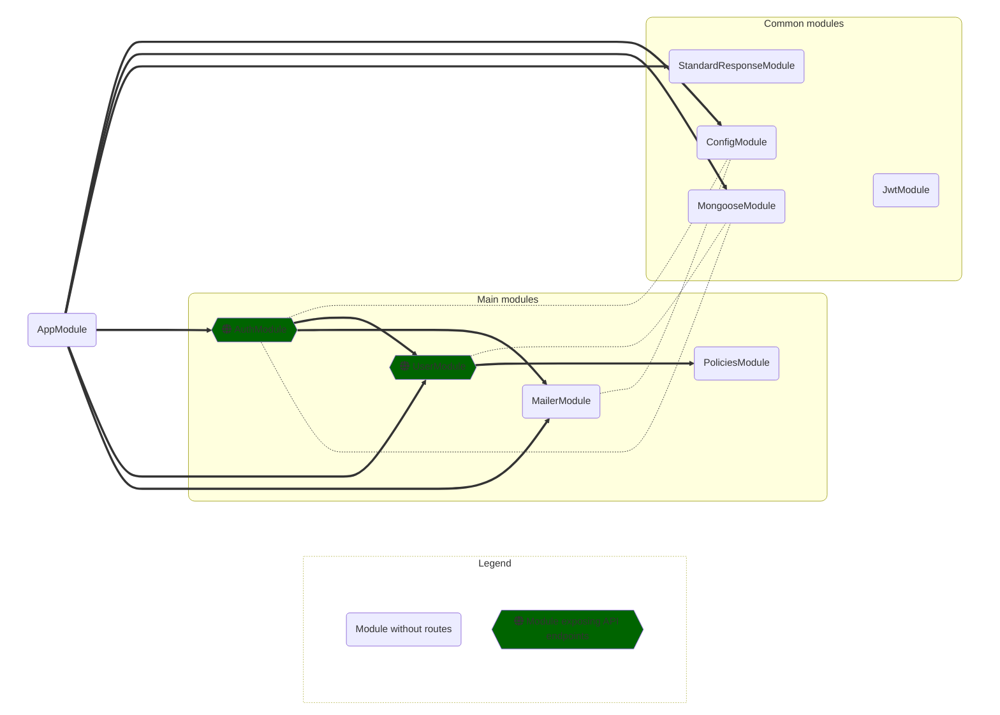

# A fully-decorated nest ready to fly

<a href="https://www.npmjs.com/package/nest-pret" target="_blank"></a>
<a href="https://github.com/simioni/nest-pret/blob/main/LICENSE" target="_blank"></a>
<a href="https://www.npmjs.com/package/nest-pret" target="_blank"></a>
<a href="https://www.npmjs.com/package/nest-pret" target="_blank"></a>
<a href="https://www.npmjs.com/package/nest-pret" target="_blank"></a>
<!-- <a href="https://app.circleci.com/pipelines/github/simioni/nest-pret" target="_blank"></a> -->


### Tested, documented, and production-ready.
</br>

**Nest Pret** is a replicable NestJS project that solves much of the functionality required from a modern web app.

- User registration
- Password recovery<!-- - User consent for TOS, Cookies, Policies, etc -->
- E-mail verification, configurable between:
  - ***required*** before login
  - ***delayed*** until a route with `EmailVerifiedGuard` enforces it
  - or ***off***
- Claims-based access control, including:
  - Restricted access to routes via policies
  - Restricted access to specific documents by ownership or other conditional constraints
  - Serialization of response objects exposing only the fields the user has access to
- Standardized API responses, including:
  - Automatic wrapping of return objects into a StandardResponse
  - Metadata-based — handlers remains returning Classes compatible with interceptors
  - Handling of pagination, sorting and filtering
  - Generation of OpenAPI documentation for routes with the proper combined response schema
  <!-- - Generation of OpenAPI response examples with proper serialization for each user role -->
- Secure defaults:
  - Sets secure HTTP response headers
  - Global validation of all request inputs
  - Global validation of response values before serialization
  - Rate-limiting across the app with tighter limits for account creation
- Configurable
  - Config module parses and validates .env variables during bootstrap
  - Config service makes them available app-wide with proper type definitions
- Deployable
  - Docker compose environmets for dev and e2e testing
  - Docker swarm stack ready for continous deployment
- Tested
  - Complete end-to-end testing suites
  - 100% coverage of all user interaction flows

<br />

# Getting started

* Clone this repo
* Edit the ```.env``` file and add at least your mailer service information.

<br />

## 🐳 &nbsp; Start using Docker
To start using Docker, run:

    npm run dev

This will start a docker compose with:
- the dev database<!-- - a redis instance; -->
- a mongo-express visual DB admin page at `localhost:8081`
- the NestJS app in watch mode at `localhost:3000`

Only for the `development` env, the app will also serve documentation and a dependency graph:

- Swagger UI documentation explorer: `localhost:3000/dev-tools/docs`
- Swagger documentation JSON: `localhost:3000/dev-tools/docs-json`
- MermaidJS graph providing a high level view of the inter-module dependencies: `localhost:3000/dev-tools/graph.mmd`

> If running in Docker, you're not required to run ```npm install``` locally, but you still might want to do so in order to get features such as auto-import and auto-complete in your code editor.

<br />
<br />

## 🐧 &nbsp; Start without docker

Make sure to edit ```.env``` file to add the connection information for your mongo database, then run:

    npm install
    npm run start:dev

<br />
<br />

## 🧐 &nbsp; Running tests

To run unit and integration tests (locally):

```
npm run test
```
or 
```
npm run test:watch
```

To run e2e tests:

```
npm run e2e
```

> This command will lift a full docker compose configuration with the testing environment, run all the tests against it, print the output, then immediately exit and prune all docker resources created.

You can also run e2e tests in watch mode:

```
npm run e2e:watch
```

Note that running in this mode will keep the entire docker testing environment up. Once you're done with testing, you can take it down and clear everything by running:

```
npm run e2e:down
```

<!-- <br />
<br />

## 🚀 &nbsp; Running in production

Make sure to edit the `.env` file to add the correct production information for your domain, mailer service, and a private container registry where the application container will be published to.

### On your local machine:

Test, build and publish the container

```
npm run e2e
npm run build
npm run publish
```

### Prepare the servers:
1. Start one or more servers or VPSs on your cloud provider of choice and install Docker on them;
2. Start docker in swarm mode; If running multiple servers, add them to the swarm;
3. SSH into the swarms *manager node* and copy the following files onto it: `.env`, `docker-swarm.yml`, `package.json`;
4. Still on the manager node, run:

```
npm run prod
```

This will start the following containers onto the swarm:

- nginx as a reverse proxy
- the production database
- redis
- the NestJS app

When running in `production` env, the app will not provide the same tools it does in development (documentation and dependency graph). It does, however, provide some other tools:

- mgob for periodic database backups
- metrics & monitoring

## Rolling updates

Once you've changed your code and are ready to update the production version, make sure to test, build and publish your updated container:

```
npm run e2e
npm run build
npm run publish
```

Then SSH into your server and run:

```
npm run update
```

The swarm will start new updated containers to replace the current ones with zero downtime. If the update fails for some reason, you can rollback the update by running:

```
npm run rollback
``` -->

<br />

---------------------------------------------------------------------------
<!-- # Motivation

NestJS achieves a great balance between performance, development speed and developer experience. By using TS/JS, it can tap on a vast ecosystem of libraries and tools

This project:
- enforces automatic linting and code formatting;
- is fully tested and encourages test-driven development;
- provides a "single source of truth" architecture for data Models that grant security in operations while avoiding code duplication;

<br />

## Model Classes as a "single source of truth" for data entities

In Typescript, data Models and their property types are usually defined as an `Interface` that is implemented by a schema or entity class 

- A schema, used by mongoose to provide type safety (and code completion, easier refactoring, etc...)
  - The schema contains all properties from the model, and represents the data exactly as it is saved in the DB
- Data validation on input
  - Contain only the fields that are acceptable for a given operation -->

# Tech stack

* Docker [compose](https://github.com/docker/compose) for development and testing, and [swarm](https://dockerswarm.rocks/) for deployment;
* Typescript
* MongoDB
* NestJS <sup>[source](https://github.com/nestjs/nest)</sup>
* Mongoose <sup>[source](https://github.com/Automattic/mongoose)</sup>
* PassportJS <sup>[source](https://github.com/jaredhanson/passport)</sup>
* Casl <sup>[source](https://github.com/stalniy/casl)</sup>
* Nodemailer <sup>[source](https://github.com/nodemailer/nodemailer)</sup>
* Nest Standard Response <sup>[source](https://github.com/simioni/nest-standard-response)</sup>
* Jest <sup>[source](https://github.com/jestjs/jest)</sup>
* PactumJS <sup>[source](https://github.com/pactumjs/pactum)</sup>
* NestJS Spelunker <sup>[source](https://github.com/jmcdo29/nestjs-spelunker)</sup>
* MermaidJS <sup>[source](https://github.com/mermaid-js/mermaid)</sup>
* Swagger / OpenAPI <sup>[source](https://github.com/swagger-api)</sup>

<br />

# App Graph



# Models

Model Classes serve as a 'single source of truth' for all modeled data. They are are used as the base for creating mongoose [schemas](https://mongoosejs.com/docs/typescript/schemas.html), but they are also used to create DTOs using [Mapped Types](https://docs.nestjs.com/openapi/mapped-types).

The information on Model properties also define input validation rules enforced when the model is expected in requests, and to define serialization rules when the model is send in responses.

Finally, model properties can also provide OpenAPI documentation information, like descriptions and usage examples.

Having all this information present in a central Model Class avoids code duplication, since derivative classes only need to define what properties of the Model they want, without worrying about providing documentation, examples, validation rules, etc.

This means that properties on Model Classes can have up to ***4 types*** of decorators on them:

1. ***Schema*** - `@Prop()` from '@nestjs/mongoose' to add the property to the schema;
2. ***Docs*** - `@ApiProperty()` from '@nestjs/swagger' to add documentation and examples;
3. ***Serialization*** - `@Exclude()`, `@Expose()`, and `@Transform()` from 'class-transformer' to define serialization rules;
4. ***Validation*** - `@IsString()`, `@IsEmail()`, `@Min()`, etc... from 'class-validator' to perform input validation;
 
When sending data back in responses, it's important to always send instances of a Model Class. Never send documents retrieved from the database directly as reponses! The serialization rules (and all other benefits from the model) only apply to instances of the Model, not instances of a schema.

When receving data in requests, use a Model Class or a DTO mapped from a Model. This way the data gets auto validation from the global `ValidationPipe`, plus the route gets auto documentation in Open API.

---------------------------------------------------------------------------
# Reference <a name="RefIndex"></a>

* [Auth Module](#AuthModule) 🚪
* [Policies Module](#PoliciesModule) 🏛️
  * [CaslAbilityFactory](#CaslAbilityFactory)
  * [PoliciesGuard](#PoliciesGuard) <sup>guard</sup>
  * [@CheckPolicies()](#CheckPoliciesDecorator) <sup>decorator</sup>
  * [@UserAbilityParam()](#UserAbilityParamDecorator) <sup>parameter decorator</sup>
* [User Module](#UserModule) 👤
  * [EmailVerifiedGuard](#EmailVerifiedGuard) <sup>guard</sup>
  * [EmailOrIdPipe](#EmailOrIdPipe) <sup>pipe</sup>
* [Mailer Module](#MailerModule) 📮
* [Config Module](#ConfigModule) ⚙️
* [StandardResponse Module](#StandardResponseModule) 📦
  * [@StandardResponse()](#StandardResponseDecorator) <sup>decorator</sup>
    * [StandardResponseOptions](#StandardResponseOptions)
    * [@StandardParam()](#StandardParamDecorator) <sup>parameter decorator</sup>
  * [@RawResponse()](#RawResponseDecorator) <sup>decorator</sup>
  * [Advanced Configuration](#StandardResponseConfiguration)
* [Testing Factories](#TestModule) 🧪
  * [TestingServerFactory](#TestingServerFactory)
  * [UserStubFactory](#UserStubFactory)

</br>


# Auth Module <a name="AuthModule"></a> 🚪
<p align="right"><a href="#RefIndex"><small>Back to index ⬆<small></a></p>

- Allows account creation;
- Sends e-mail verification and keeps track of confirmation status;
- Sends forgotten password emails and allows password reset;
- Manages log-in and JWTs;
- Guard routes from unlogged users and injects the logged-in user into the request.

</br>
</br>

# Policies Module <a name="PoliciesModule"></a> 🏛️
<div align="right"><a href="#RefIndex"><sup>Back to index &nbsp; ⤴️<sup></a></div>

- Defines policies limiting any individual user to access only resources they can claim;
- Claims define which `Actions` (create, read, update, etc...) any user `Role` can take on each `Model`;
- Claims can also define *constraint queries*, for example allowing a user to read the `User` model, but only for his own user; or to update `Articles`, but only those authored by himself;

> Note: There is no `Articles` module provided by this app. This is just an example on how you can define policies for any model you want.

Policies are defined using [Casl](https://github.com/stalniy/casl).

<br />

## CaslAbilityFactory <a name="CaslAbilityFactory"></a>

The `CaslAbilityFactory` provider exposes the `createForUser` function, which is called during a request with the logged-in user information, and should return a casl `Ability` object constructed using the provided `can` or `cannot` methods. This function is free to inspect the user object and define any custom logic it needs to limit individual access to `actions` taken on `models`.

Example:

```ts
if (user.roles.includes(UserRole.USER)) {
  // users can view and update their own info,
  // view any article, and update articles authored by them
  can([Action.Read, Action.Update], User, { _id: user._id });
  can(Action.Read, Article);
  can(Action.Update, Article, { authorId: user._id });
}
if (user.roles.includes(UserRole.MOD)) {
  // mods can read and update any user or any article
  can([Action.Read, Action.Update], User);
  can([Action.Read, Action.Update], Article);
}
if (user.roles.includes(UserRole.ADMIN)) {
  // admins can do anything. Note that 'manage' in casl means all actions,
  // and the keywork 'all' means in all models. Common actions are 'create',
  // 'read', 'update', 'delete' and 'list', but you can extend the Actions enum
  // with any other action you want
  can(Action.Manage, 'all');
}
```

<br />

## Protecting routes <a name="PoliciesGuard"></a><a name="CheckPoliciesDecorator"></a>

Just add the `PoliciesGuard` to any controller or route. Since policies depend on the user object, using this guard also requires using `AuthGuard` or other mechanism that guarantees log-in.

```ts
@UseGuards(AuthGuard('jwt'), PoliciesGuard)
```

Once this guard is in place, you can add the `@CheckPolicies()` decorator to any route, and choose the claims that are required to access this route. `@CheckPolicies()` expects a simple function that is called with the `userAbility` object, so you can use `can` or `cannot` methods on it to define which Actions this route requires on which Models.

```ts
@CheckPolicies((ability: UserAbility) => ability.can(Action.List, User))
```

Checking policies in this way is very efficient, since requests can be denied at the Guard level, without even executing the route handler. But it is also limited: it cannot check for *constraint queries* since no document has been retrieved from the DB yet. If the logged-in user has access to ***at least one document*** for a given Model, it will be granted access by the guard, and you should check for constraints during the route handling.

<br />

## Protecting access per-document <a name="UserAbilityParamDecorator"></a>

- The `userAbility` object is also injected in the request object, and you can retrieve it by using `req.userAbility`;
- If this is all you're using from the request object, it can be cleaner to inject it directly using the custom param decorator `@UserAbilityParam()`;

This allows you to retrieve documents from the database and call the `can` or `cannot` methods against them. Note that here these methods are called using an instance of the model (instead of on the Model class itself).

```ts
function findOne(
  @UserAbilityParam() userAbility: UserAbility,
) {
  const user = await this.userService.findOne(idOrEmail);
  if (userAbility.cannot(Action.Read, user)) {
    throw new ForbiddenException();
  }
  return user;
}
```
</br>

# User Module <a name="UserModule"></a> 👤

- Defines the User model, schema and DTOs;
- Defines the services required to create, read, update, delete, list, reset password, and verify email;
- Most services from this module are consumed by the Auth module for managing accounts;
- The user controller provides routes that can be used by admins to manage users from a backend outside of the auth flow;
- Some routes can also be used by users to view or update their own profile;

<br />

## EmailVerifiedGuard <a name="EmailVerifiedGuard"></a>

If the app is configured to use ***delayed*** email verification, users will be logged in automatically after account creation, and will be allowed to login anytime without clicking the verification link.

To protect access to certain routes only to users who have verified their email, you can add the ```EmailVerifiedGuard``` to any controller or route.


```ts
@UseGuards(EmailVerifiedGuard)
```

>- If the app is configured to use ***required*** email verification, users will be asked to verified their email before being allowed to log-in. In that case, this guard is redundant.
>
>- If the app is configured with email verification ***off***, this guard shoud not be used, since it will never allow access to the routes under it.
>
>- The routes from the `UserController` that allow users to view and edit their own information use this guard. If you're setting this setting to ***off***, you should also remove this guard from that controller.

<br />

## EmailOrIdPipe <a name="EmailOrIdPipe"></a>

Both `email` and `id` are unique keys in the user schema. An `id` provides consistency since it should never be changed, and also provides some privacy if you need to include a user reference in a public link without exposing their `email`. However, sometimes using an email can be more convenient.

That's why routes and services from the `User` module accept **both** an `id` or an `email` as the target for their operations. To validate the input parameters in those cases, the app provides the `EmailOrIdPipe` pipe.

```ts
@Controller('user')
export class UserController {
  constructor(private readonly userService: UserService) {}

  @Get(':idOrEmail')
  public async findOne(
    @Param('idOrEmail', EmailOrIdPipe) idOrEmail: string
  ): Promise<User> {
    const user = await this.userService.findOne(idOrEmail);
    ...
  }
}
```

When used, it makes sure the piped data is either a syntactically valid `email` or a syntactically valid `ObjectId`. Note that a pipe can only check for syntax. It will throw a HTTP 400 BadRequestException if the provided information is malformatted, but it's possible that the information is valid yet still doesn't match any known user from the DB.

</br>
</br>

# Mailer Module <a name="MailerModule"></a> 📮

- Automatically creates and configures a nodemailer instance using info from the .env file injected by the config module;
- Defines services for sending emails;
- Currently this module can send the following emails:
  - Welcome
  - Please confirm yout email
  - Forgot your password?
  - Your password was reset

</br>

# Config Module <a name="ConfigModule"></a> ⚙️

- Prevents runtime errors by validating environment variables during app startup;
- Provides helpful console messages when envorinment variables are missing or invalid;
- Parses `.env` vars into a strongly typed Configuration object that can be dependency injected;
- Exposes interfaces that can be used to provide types when calling the `configService.get<>()` generic method;

Example:
```ts
@Controller('books')
export class BooksController {
  constructor(private readonly configService: ConfigService) {}

  @Get()
  public async listBooks() {
    const apiConfig = this.configService.get<ApiConfig>('api'); 
    // equivalent to process.env.API_INTERNAL_URL,
    // but parsed, typed, and guarateed to exist
    console.log(apiConfig.internalUrl);
  }
}
```

</br>

# Standard Response Module <a name="StandardResponseModule"></a> 📦

> [StandardReponse](https://github.com/simioni/nest-standard-response) has been exported into a separate package. The full documentation now resides in [it's own repo](https://github.com/simioni/nest-standard-response).

</br>

* Metadata-based wrapper to provide customizable and standardized API response objects;

* Built-in handling of pagination, sorting and filtering;

* Allows route handlers to keep returning classes instead of wrapper objects, so they remain fully compatible with interceptors;

<table style="width: 100%">
<tr>
<td>

```ts
// 👇 just annotate a route with
// @StandardResponse() and choose
// the features you need
@get("/books")
@StandardResponse({
  isPaginated: true,
  isSorted: true,
  isFiltered: true,
})
async listBooks(
  // 👇 then inject a @StandardParam() into
  // the handler to access the features
  @StandardParam() params: StandardParams
): BookDto[] {
  const {
    books,
    count
  } = await this.bookService.list({
    // 👇 this route can now be called with
    // query parameters, fully parsed and
    // validated to use in services
    limit: params.pagination.limit,
    offset: params.pagination.offset,
    sort: params.pagination.sort,
    filter: params.pagination.filter,
  });
  // 👆 to see how the 'sort' and 'filter'
  // params are parsed, look at the 
  // SortingInfo and FilteringInfo classes
  // in the @StandardParam() section of
  // StandardResponse's Docs

  // 👇 add extra information into the response
  params.setPaginationInfo({ count: count })
  params.setMessage('Custom message...')
  return books;
}
```

</td>
<td>

```ts
// response
{
  success: true,
  message: "Custom message...",
  isArray: true,
  isPaginated: true,
  isSorted: true,
  isFiltered: true,
  pagination: {
    limit: 10,
    offset: 0,
    defaultLimit: 10,
    // 👇 added in handler
    count: 33
  },
  sorting: {
    query: ...,
    sortableFields: [...],
    sort: SortingInfo
    // check docs
  },
  filtering: {
    query: ...,
    filterableFields: [...],
    filter: FilteringInfo
    // check docs
  },
  data: [
    { title: "Dune", year: 1965 },
    { title: "Jaws", year: 1974 },
    { title: "Emma", year: 1815 },
  ]
}


```

</td>
</tr>
</table>

```ts
// this route can now be called using query params like this:
'/books?limit=8&offset=16&sort=-author,title&filter=author^=Frank;year>=1960;year>=1970'
```

ℹ️ Check out the [full documentation](https://github.com/simioni/nest-standard-response) to learn:

- How to [build the query](https://github.com/simioni/nest-standard-response#--building-the-search-query);
- How the query is parsed: [SortingInfo](https://github.com/simioni/nest-standard-response#--sortinginfo), [FilteringInfo](https://github.com/simioni/nest-standard-response#--filteringinfo) and [PaginationInfo](https://github.com/simioni/nest-standard-response#--paginationinfo);
- How to use the decorators: [@StandardResponse()](https://github.com/simioni/nest-standard-response#--standardresponseoptions-standardresponseoptions-) and [@StandardParam()](https://github.com/simioni/nest-standard-response#--standardparam-);
- and other options.


</br>

# Test Module <a name="TestModule"></a> 🧪

- Provides end-to-end testing of all user interaction flows;
- e2e tests run in docker, always on a freshly created environment;
- Jest runs tests in parallel, so each test file needs to instantiate the app in it's own thread;
- The DB is shared between all threads. To avoid racing conditions, the DB should never be dropped during testing. Use the provided factories to create and destroy resources instead.

To facilitate creating and destroing instances of the NestJS application, as well as creating and destroing all kinds of different users, this project provides two utility factories:

<br />

## *TestingServerFactory* & *UserStubFactory* <a name="TestingServerFactory"></a><a name="UserStubFactory"></a>

<br />

When adding new modules to the app, create a related `yourmodule.e2e-spec.ts` test file in the `/tests` folder, and inside the `beforeAll` hook from jest, instantiate a new app by calling `await new TestingServerFactory().create()`.

This method will create a new nest TestingModule, mock the mailer service, start the app, auto-increment the port number to avoid conflicts, and return a class instance with methods to retrieve all the created resources, like the `getModule()`, `getApp()` and `getBaseUrl()`.

Since this gives you access to the underlying NestJS TestingModule, you can get reach any part of the nest app by using the `get()` and `resolve()` methods on the module.

To create stub users for testing access control and serialization features, use the ***UserStubFactory***. It provides methods for creating regular users, users with verified emails, admin users, etc. And also methods to login those users and get their access tokens, as well as deleting them when no longer needed.

Remember to delete any created stub user in the `afterAll` hook, as well as calling `app.close()`.

Example:

```ts
describe('BooksController (e2e)', () => {
  let app: INestApplication;
  let stub: UserStubFactory;
  let verifiedUser: FakeUser;
  let verifiedUserToken: string;
  beforeAll(async () => {
    const testingServer = await new TestingServerFactory().create();
    const testingModule = testingServer.getModule();
    app = testingServer.getApp();
    booksService = await testingModule.resolve(BooksService);

    stub = new UserStubFactory(testingServer);
    verifiedUser = await stub.registerNewVerifiedUser({ firstName: 'Martha' });
    verifiedUserToken = await stub.getLoginTokenForUser(verifiedUser);
  });
  afterAll(async () => {
    await stub.deleteUser(verifiedUser.email);
    await app.close();
  });
}
```

</br>

<br />
<br />
<br />

---------------------------------------------------

# Tips

## 🔮 You should return class instances from route handlers, not plain objects or DB documents <a name="HandlersMustReturnClassInstances"></a>
NestJS' request pipeline greatly benefits from receiving DTOs or Model class instances as responses from request handlers. This allows interceptors to perform serialization, caching, and other data transformations to the document before sending it to the client.

StandardResponse also rely on an interceptor that uses reflection to read the metadata set by its decorators. Since the typing information and other metadata for Models or DTOs is set on the class that represents them, you need to return instances of these classes from route handlers.

<br />
<br />

## 🔮 Use concrete JS classes as types, not typescript interfaces

Typescript interfaces are completely removed from compiled code. Since we want to perform data validation and transformation during execution, we need the typing information to be available at runtime. NestJS (as well as this library) achieve this by storing type, validation constrainsts and other metadata as properties in the classes that describe the data objects. These can be Models, Entities, Schemas, DTOs or any other class that was anotated with the proper decorators.

<br />
<br />
<br />

---------------------------------------------------

<br />

## 🚀 &nbsp; TODO Milestones

- Add a Redis instance in docker-compose, and:
  - expose it's config via .env and the config module;
  - Cache the user from login tokens so we don't need to hit the DB in every request to retrieve it;
  - Cache the abilities created by casl for a given user so it don't need to be recreated inside the policies every on every request;
- Replace express-rate-limit with nestjs' built-in throttler, exposing it's config via .env, and sharing storage in Redis
- Add a [mgob](https://github.com/maxisam/mgob) instance to docker-compose for automated mongo backups (and add its configurations via .env)
- Add user consent forms with versioned policies
- Add option for log-in using social media accounts

</br>


🏭 ⭐️ 🕹️ 💡 💎 🔩 ⚙️ 🧱 🔮 💈 🛍️ 🎁 🪭 ⚜️ ❇️ 🚩
📦 🏷️ 📮 
🟠 🟧 🔶 🔸